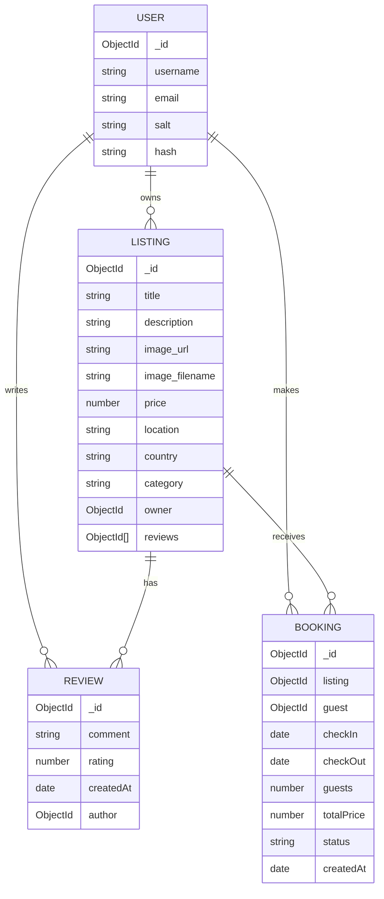

# 🏰 Property Lords — Premium Rental & Booking Platform

[](https://nodejs.org/)
[](https://expressjs.com/)
[](https://www.mongodb.com/)
[](https://getbootstrap.com/)
[](https://leafletjs.com/)
[](https://cloudinary.com/)
[](http://www.passportjs.org/)

Property Lords is a premium, full-featured property renting and booking web application built using the robust **Model-View-Controller (MVC)** architectural pattern. Inspired by modern travel marketplaces, it allows users to discover, list, review, and book spectacular properties around the world. The application is crafted with secure session-based authentication, server-side data validation, media cloud uploads, interactive mapping, and a highly responsive design system.

🌐 **Live Demo:** https://property-lords.onrender.com/listings

📂 **GitHub Repository:** https://github.com/VinayVaghani/Property-Lords-property-renting-platform


---

## 🌟 Key Features

*   🏠 **Property Listings Management**: Complete CRUD operations for properties. Owners can create, update, and delete their listings, complete with title, description, price, location, country, and image uploads.
*   👤 **Secure Authentication & Session Management**: Implemented via **Passport.js** (Local Strategy) and persisted with **connect-mongo**. Includes registration, login, logout, and smart route-redirection (returning users to their intended page after logging in).
*   📅 **Comprehensive Booking System**: Guests can book properties for specific dates and guest counts. The system dynamically calculates total costs based on nights stayed, manages booking statuses, and lists active/past bookings with cancellation capabilities.
*   💬 **Interactive Reviews & Ratings**: Users can leave star ratings and comments on properties. A secure authorization layer ensures only the review authors can delete their own reviews.
*   🗺️ **Dynamic Location Maps**: Integrated with **Leaflet.js** and **OpenStreetMap (Nominatim API)** to automatically geocode listing locations and display interactive markers on a map for guests.
*   ☁️ **Cloud Media Uploads**: Handles property image uploads seamlessly using **Multer** and stores them securely in **Cloudinary**, applying automatic image resizing for edit forms.
*   🔍 **Advanced Search & Category Filtering**: Users can search properties by title, location, or country, or filter them instantly by categories (such as *Trending*, *Rooms*, *Castles*, *Mountains*, *Amazing Pools*, *Camping*, *Farms*, *Domes*, *Boats*).
*   🛡️ **Data Validation**: Strict schema verification using **Joi** on the server side prevents invalid inputs for listings and reviews.

---

## 📂 Project Directory Structure

Below is the directory layout of the **Property Lords** workspace, showing the separation of concerns across different layers:

```text
Property Lords/
├── controllers/          # Business logic handlers for each route
│   ├── bookings.js       # Handles booking creation, listing, and cancellation
│   ├── listings.js       # Handles listing CRUD, search, and category filtering
│   ├── reviews.js        # Handles review creation and deletion
│   └── users.js          # Handles signup, login, and logout routines
├── init/                 # Database initialization and seeding scripts
│   ├── data.js           # Sample dataset containing initial property listings
│   └── index.js          # Database seeding script with auto-categorization logic
├── models/               # Mongoose schemas and models (MongoDB collections)
│   ├── booking.js        # Booking schema (references User and Listing)
│   ├── listing.js        # Listing schema (references User and Reviews)
│   ├── review.js         # Review schema (references User)
│   └── user.js           # User schema (plugs into Passport Local Mongoose)
├── public/               # Static assets served directly to the client
│   ├── css/              # Custom style sheets (style.css, rating.css)
│   └── js/               # Client-side scripts (script.js, Leaflet map.js)
├── routes/               # Express routers mapping URLs to controllers
│   ├── booking.js        # Booking routes (/bookings)
│   ├── listing.js        # Listing routes (/listings)
│   ├── review.js         # Review routes (/listings/:id/reviews)
│   └── user.js           # User authentication routes (/)
├── utils/                # Utility modules and helpers
│   ├── ExpressError.js   # Custom error class supporting HTTP status codes
│   └── wrapAsync.js      # Middleware wrapper to handle asynchronous exceptions
├── views/                # EJS templates for rendering HTML views
│   ├── bookings/         # Booking list views
│   ├── includes/         # Reusable page sections (navbar, footer, flash alerts)
│   ├── layouts/          # EJS-mate boilerplate layout wrapper
│   ├── listings/         # Listing views (index, show, edit, new)
│   ├── users/            # Authentication views (login, signup)
│   └── error.ejs         # Error boundary template page
├── app.js                # Application entry point, configuration, and middleware pipeline
├── cloudConfig.js        # Cloudinary cloud storage and Multer integration
├── middleware.js         # Custom route guards (authentication, authorization, Joi validators)
├── schema.js             # Server-side data validation schemas using Joi
├── package.json          # Node.js project manifest and dependency tracker
└── .env                  # Local environment configuration file (ignored by git)
```

---

## 🏗️ Data Architecture & Relationships

The database is structured in MongoDB using Mongoose. The diagram below illustrates how the data collections are linked:



### Model Implementations:
1.  **User Model (`models/user.js`)**: Integrates `passport-local-mongoose` to automatically manage usernames, hashed passwords, and cryptographic salts.
2.  **Listing Model (`models/listing.js`)**: Represents a rental property. It holds references to a `User` (the owner) and an array of `Review` object IDs. A `findOneAndDelete` pre-hook is registered to automatically wipe out associated reviews from the database when a listing is deleted.
3.  **Review Model (`models/review.js`)**: Holds comments, star ratings (1-5), a timestamp, and references the `User` who authored it.
4.  **Booking Model (`models/booking.js`)**: Holds check-in and check-out dates, total guests, dynamically computed price, booking status (`confirmed`, `cancelled`, `completed`), and references to both the guest (`User`) and the `Listing`.

---

## 🛣️ API Endpoints & Routes

The application exposes a structured set of RESTful routes, protected by targeted middlewares:

| Module | HTTP Method | Route / Endpoint | Middlewares | Functionality |
| :--- | :--- | :--- | :--- | :--- |
| **Listings** | `GET` | `/listings` | *None* | Displays all listings (supports search query & category filters) |
| | `POST` | `/listings` | `isLoggedIn`, `upload.single('image')`, `validateListing` | Creates a new listing with image upload to Cloudinary |
| | `GET` | `/listings/new` | `isLoggedIn` | Renders the form to create a new listing |
| | `GET` | `/listings/:id` | *None* | Displays details of a specific listing, its reviews, and map |
| | `GET` | `/listings/:id/edit` | `isLoggedIn`, `isOwner` | Renders the edit form for a listing with resized image preview |
| | `PUT` | `/listings/:id` | `isLoggedIn`, `upload.single('image')`, `isOwner`, `validateListing` | Updates listing details and updates image on Cloudinary if provided |
| | `DELETE` | `/listings/:id` | `isLoggedIn`, `isOwner` | Deletes a listing and all of its associated reviews |
| **Reviews** | `POST` | `/listings/:id/reviews` | `isLoggedIn`, `validateReview` | Adds a star-rated review and comment to a listing |
| | `DELETE` | `/listings/:id/reviews/:reviewId` | `isLoggedIn`, `isReviewAuthor` | Deletes a specific review and removes its reference from the listing |
| **Bookings** | `POST` | `/bookings/:id` | `isLoggedIn` | Creates a property booking (calculates total price, dates, and guests) |
| | `GET` | `/bookings` | `isLoggedIn` | Displays a dashboard of all bookings made by the current user |
| | `POST` | `/bookings/:id/cancel` | `isLoggedIn` | Cancels a booking, updating its status to `cancelled` |
| **Users** | `GET` | `/signup` | *None* | Renders the user registration form |
| | `POST` | `/signup` | *None* | Registers a new user and logs them in immediately |
| | `GET` | `/login` | *None* | Renders the login form |
| | `POST` | `/login` | `saveRedirectUrl`, `passport.authenticate` | Authenticates the user and redirects to their intended page or `/listings` |
| | `GET` | `/logout` | *None* | Terminates the session and logs the user out |

---

## ⚙️ Core Logical Workflows

### 1. Booking Price & Duration Calculation
When a user submits a booking, the `createBooking` controller (`controllers/bookings.js`) executes the following logic:
*   Parses the check-in and check-out dates.
*   Enforces that the check-out date is chronologically after the check-in date.
*   Calculates the duration in days:
    $$\text{Days} = \left\lceil \frac{\text{Check-out Date} - \text{Check-in Date}}{1000 \times 60 \times 60 \times 24} \right\rceil$$
*   Multiplies the number of days by the listing's nightly price to determine the `totalPrice`.
*   Saves the booking with a default status of `confirmed`.

### 2. Authentication & Authorization Guards (`middleware.js`)
Security is implemented using Express middleware at the route level:
*   `isLoggedIn`: Checks if `req.isAuthenticated()` is true. If not, it saves the requested URL (`req.originalUrl`) to `req.session.redirectUrl` and redirects the user to `/login`.
*   `saveRedirectUrl`: Transfers the saved URL from session storage to `res.locals` so Passport can redirect the user back to where they were after a successful login.
*   `isOwner`: Checks if the logged-in user is the owner of the listing before granting access to edit, update, or delete routes.
*   `isReviewAuthor`: Restricts review deletion so only the user who created a review can delete it.

### 3. Smart Data Seeding Heuristics (`init/index.js`)
To provide a beautiful user experience right out of the box, the seeding script includes a smart classification heuristic that analyzes titles and descriptions to assign listings to appropriate UI categories:
*   **Camping**: Matched if titles/descriptions mention *cabin*, *treehouse*, *forest*, or *tent*.
*   **Mountains**: Matched if they mention *mountain*, *ski*, *chalet*, or *alps*.
*   **Castles**: Matched if they mention *castle*.
*   **Amazing Pools**: Matched if they mention *beach*, *pool*, *lake*, *ocean*, or *sea*.
*   **Rooms**: Matched if they mention *loft*, *apartment*, *room*, or *studio*.
*   **Iconic Cities**: Matched if they mention *villa*, *historic*, *town*, or *city*.
*   **Farms**: Matched if they mention *farm*, *ranch*, or *cow*.
*   **Domes**: Matched if they mention *dome*.
*   **Boats**: Matched if they mention *boat*, *houseboat*, or *yacht*.
*   *Fallback*: Assigns a random category if no keyword matches are found.

### 4. Dynamic Mapping & Geocoding (`public/js/map.js`)
To avoid requiring expensive commercial map APIs, the application implements a powerful open-source geocoding and map solution:
*   The server injects the listing's location and country into a client-side JavaScript token (`mapToken`).
*   On the client side, **Leaflet.js** initializes a map container and loads visual tiles from **OpenStreetMap**.
*   The script fires an asynchronous fetch request to the **Nominatim OpenStreetMap Search API**:
    ```text
    https://nominatim.openstreetmap.org/search?format=json&q=<LOCATION>,<COUNTRY>&limit=1
    ```
*   Upon receiving coordinates (latitude and longitude), the map smoothly pans to the coordinates, spawns a marker, and attaches an interactive popup with the property name and address. If geocoding fails, it defaults gracefully to a country-centered marker.

---

## 🛠️ Technology Stack & Dependencies

| Category | Technology / Library | Version | Purpose |
| :--- | :--- | :--- | :--- |
| **Backend Core** | **Node.js** | `v22.14.0` | JavaScript runtime environment |
| | **Express.js** | `v5.2.1` | Minimalist web framework for routing and middleware |
| **Database** | **MongoDB** | *Local/Atlas* | Document-oriented NoSQL database |
| | **Mongoose** | `v9.6.3` | Object Data Modeling (ODM) library for MongoDB |
| **Frontend Rendering**| **EJS (Embedded JS)**| `v6.0.1` | Server-side templating engine |
| | **EJS Mate** | `v4.0.0` | Layout, partials, and block support for EJS templates |
| | **Bootstrap** | `v5.3.8` | Responsive styling framework and layout utilities |
| | **FontAwesome** | `v7.0.1` | High-quality iconography set |
| **Authentication** | **Passport.js** | `v0.7.0` | Comprehensive authentication middleware |
| | **Passport Local** | `v1.0.0` | Username/password authentication strategy |
| | **Passport Local Mongoose**| `v9.1.0` | Mongoose plugin for simplified Passport setup |
| **Session & Storage** | **Express Session** | `v1.19.0` | Session middleware for tracking user states |
| | **Connect Mongo** | `v6.0.0` | MongoDB-backed session storage engine |
| | **Dotenv** | `v17.4.2` | Loads environment variables from a `.env` file |
| **File Uploads** | **Multer** | `v2.2.0` | Middleware for handling `multipart/form-data` |
| | **Cloudinary** | `v1.41.3` | SDK for interacting with Cloudinary media services |
| | **Multer Cloudinary** | `v4.0.0` | Storage engine integration between Multer and Cloudinary |
| **Utilities** | **Joi** | `v18.2.1` | Schema description language and validator for JS objects |
| | **Method Override** | `v3.0.0` | Enables HTTP verbs like PUT/DELETE where clients don't support them |
| | **Connect Flash** | `v0.1.1` | Flash message middleware for ephemeral notifications |
| | **Leaflet.js** | `v1.9.4` | Interactive mobile-friendly maps library |

---

## 🚀 Installation & Local Setup

Get the application running locally on your machine by following these steps:

### 1. Prerequisites
Ensure you have the following installed:
*   [Node.js](https://nodejs.org/) (Recommended version: `v22.14.0` or higher)
*   [MongoDB Community Server](https://www.mongodb.com/try/download/community) (running locally on port `27017`) or a MongoDB Atlas URI.
*   A free [Cloudinary Account](https://cloudinary.com/) (to obtain API credentials for image uploads).

### 2. Clone and Install Dependencies
Open your terminal and run:
```bash
# Clone the repository
git clone <repository-url>

# Navigate into the project directory
cd "Property Lords"

# Install all package dependencies
npm install
```

### 3. Configure Environment Variables
Create a file named `.env` in the root directory of the project and add your credentials:
```env
# Cloudinary Configuration
CLOUD_NAME=your_cloudinary_name
CLOUD_API_KEY=your_cloudinary_api_key
CLOUD_API_SECRET=your_cloudinary_api_secret

# MongoDB Connection String (Atlas or Local)
ATLASDB_URL=mongodb://127.0.0.1:27017/PropertyLords

# Session Secret Key
SECRET=your_session_cryptographic_secret_string
```

### 4. Seed the Database
Populate your database with the initial set of properties and auto-categorized listings by running the seed script:
```bash
node init/index.js
```
*You should see a message in your console: `connected to db` followed by `data was initialized`.*

### 5. Start the Application Server
Run the Express application:
```bash
node app.js
```
The console will output:
```text
connected to db
port is listening
```
Open your browser and navigate to **`http://localhost:4040/listings`** to explore the application!

---

Developed by [Vinay Vaghani](https://github.com/VinayVaghani). Licensed under the ISC License.
